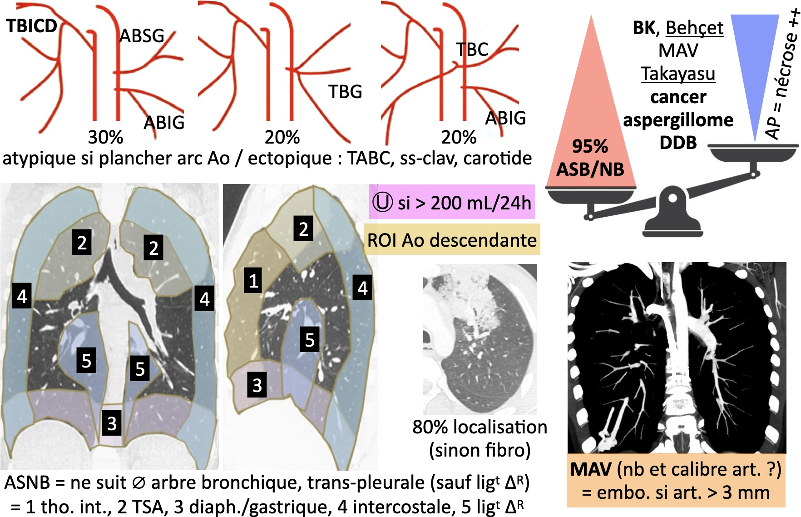

# EP, aorte et hémoptysie

!!! tip "EP [femme enceinte](https://onclepaul.net/wp-content/uploads/2011/07/EP-chez-la-femme-enceinte-CS-2013+++1.pdf){:target="_blank"} ([risques](https://onclepaul.fr/wp-content/uploads/2011/07/La-femme-enceinte-en-imagerie-pire-angoisse-du-radiologue-New-JFR-2020.pdf){:target="_blank"} de l'irradiation pour le fœtus)"
    - 100 kV
    - Apnée simple
    - 120 cc ≥ 4,5 cc/s de Ioméron 400
    - Couper apex et culs-de-sac pleuraux

!!! info "HTP"
    - HTP = AP > Ao (> 30 mm), dilatation et hypertrophie VD (> 4 mm)
    - **TEC** = thrombi marginés, synéchies, hypervasc. systémique, perfusion mosaïque

<figure markdown="span">
     
    [Syndrome aortique aigu](https://onclepaul.net/wp-content/uploads/2011/07/Syndrome-aortique-aigu.pdf){:target="_blank"}  
    TAP sans, TAP artériel +/- synchronisation ECG, AP veineux  
      
    {width="720"}
</figure>