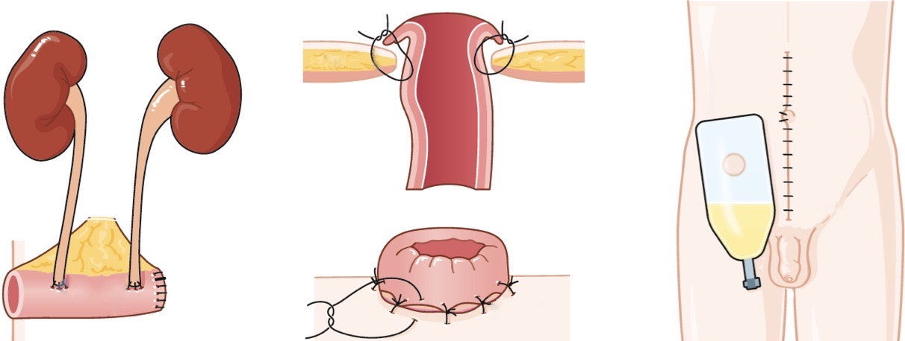
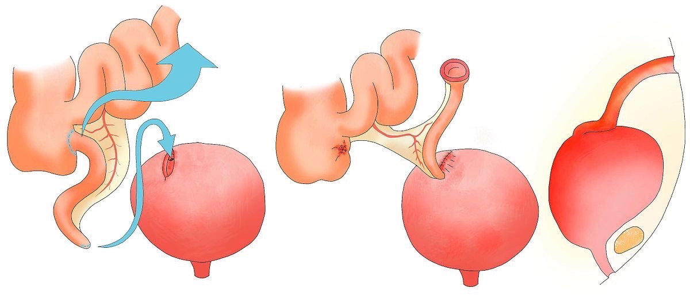
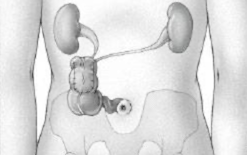
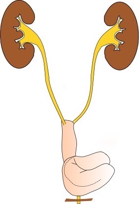

# Dérivations urinaires

<figure markdown="span">
    {width=450"}
    <b>Bricker</b> = iléon ou sigmoïde
     /!\ 10% sténose anastomose urétéro-iléale
      
    {width=400"}
    <b>Mitrofanoff</b> = vésicostomie appendiculaire
      
    {width=250"}
    poche de <b>Miami</b> = iléo-caecal continent
      
    {width=180"}
    <b>néovessie</b> = grêle
</figure>