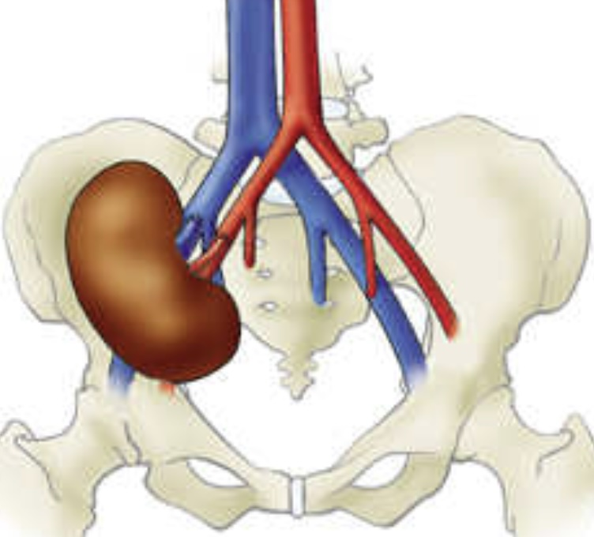
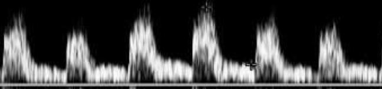
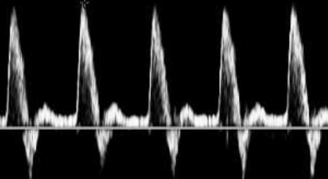
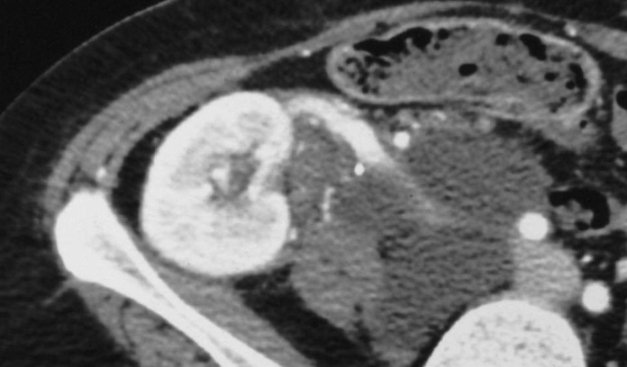
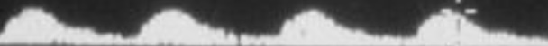
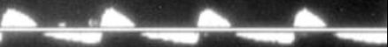
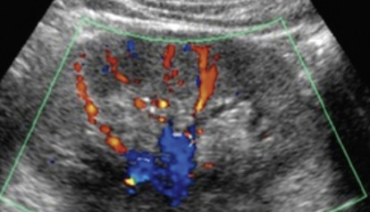

# Greffon rénal

```
Grand axe mesurant
Pas de dilatation des cavités pyélo-calicielles.
Contours réguliers et différenciation parenchymo-médullaire satisfaisante.
Pas de collection péri-rénale ni d'épanchement péritonéal.
Vessie en semi-réplétion au contenu anéchogène.

Vascularisation intra-rénale homogène.
Perméabilité des vaisseaux afférents et efférents.
Vitesse artérielle systolique maximale : 
Index de résistance intrarénale :
```

<figure markdown="span">
    {width=250"}
    </br>
    {width=250"}
    artère basse résistance
    {width=250"}
    ≠ iliaque ext. (reflux protodiastolique)  
    </br>
    {width=250"}
    10% <b>lymphocèle</b> = latéro-iliaque = effet de masse ?!
    </br>≠ urinome (fistule anastomose urétéro-vésicale)  
    </br>
    {width=400"}
    10% <b>sténose</b> art = Vmax > 2 m/s (angle < 60°), IR < 0.6 et TMS > 80 ms  
    </br>
    {width=400"}
    3% <b>thrombose</b> veineuse = < S1, œdème, reflux holodiastolique, IR > 0.8  
    </br>
    {width=250"} <b>IR</b> intrarénal = 0.7±0.1
    </br>↗ = PNA, NTA, rejet, dilatation CPC, thrombose veine, vasopresseurs
</figure>