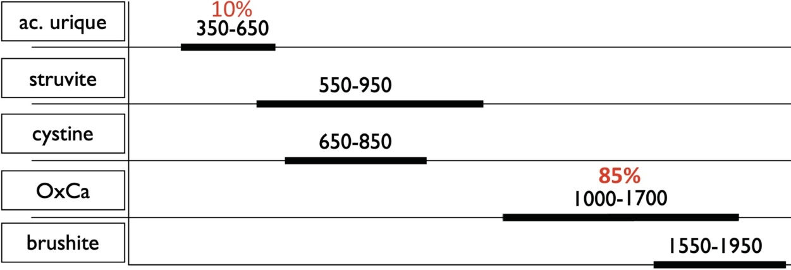
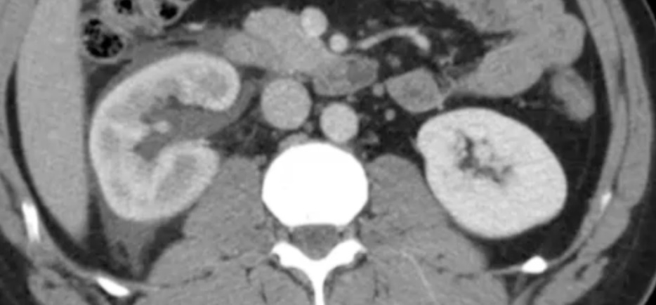
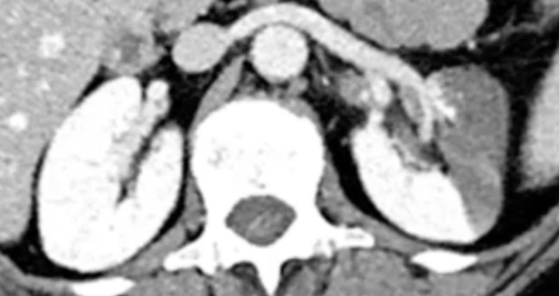
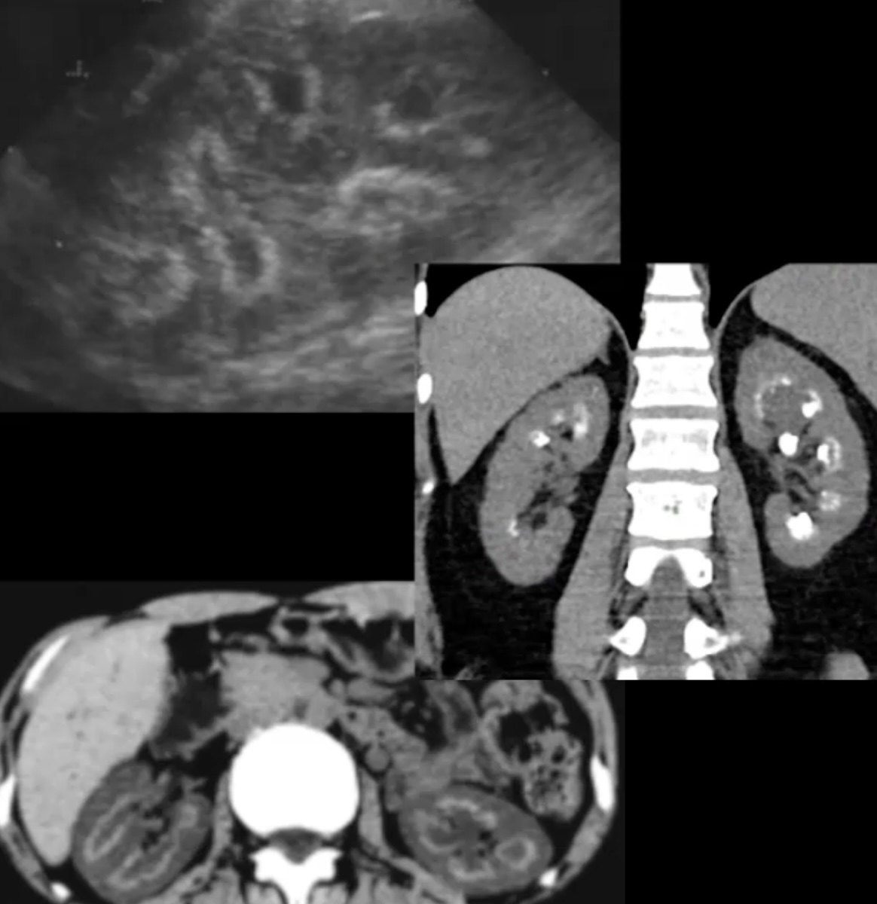

<figure markdown="span">
    <b>H40</b>, 10% pop°, récidive ++, TDM < 48h
     Ⓤ fièvre/anurie/hyperalgie/uropathie
      
    {width=650"}
     
    {width=300"}
    rupture de fornix = complication mineure
      
    {width=300"}
    TDM nég <b>H>50a</b> /!\ infarctus
      
    {width=300"}
    [néphrocalcinose](https://radiopaedia.org/articles/medullary-nephrocalcinosis){:target="_blank"} médullaire = hyperpara, [Cacchi-Ricci](https://radiopaedia.org/articles/medullary-sponge-kidney){:target="_blank"}
</figure>