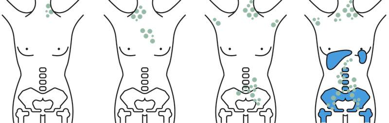
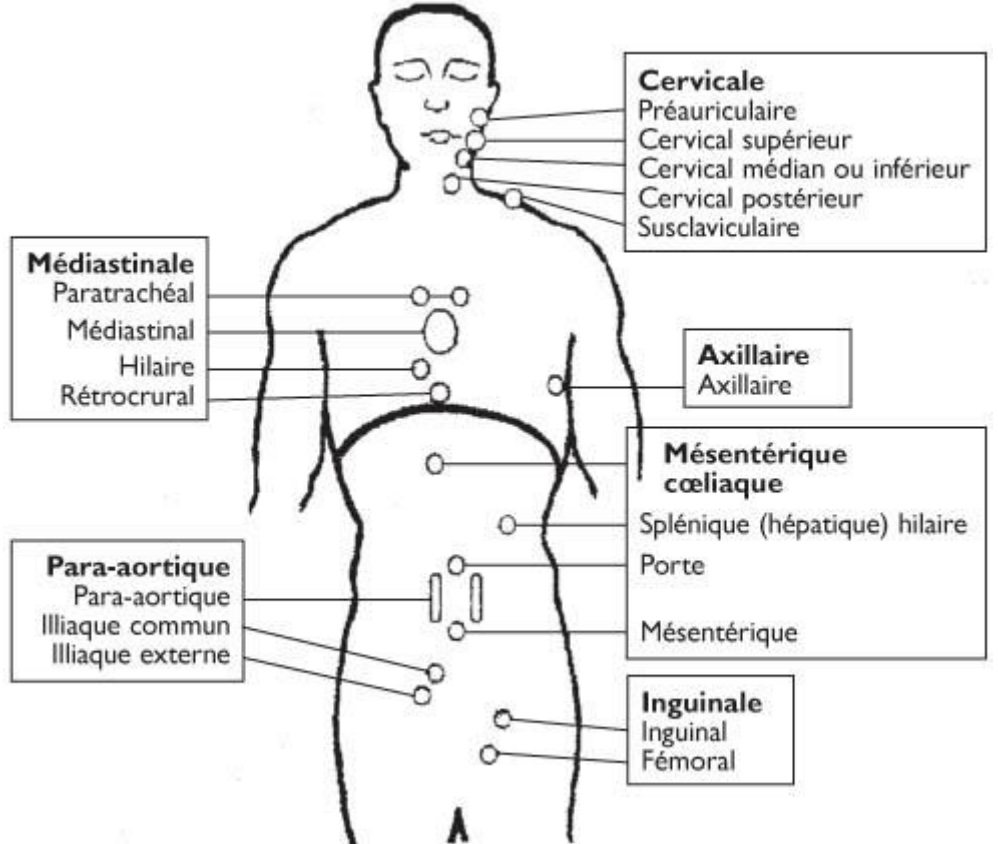
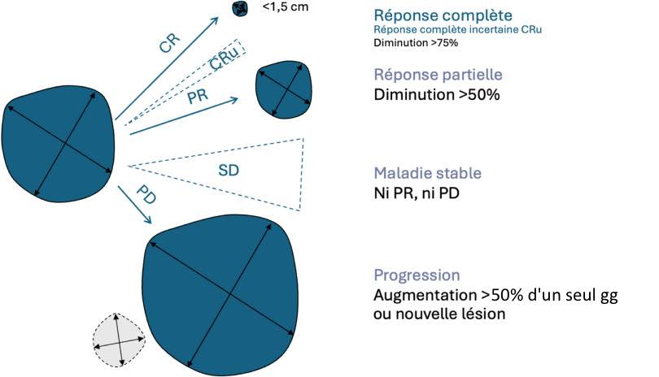

# [Lymphome](https://cerf.radiologie.fr/sites/cerf.radiologie.fr/files/files/Enseignement/pdf/09%20Imagerie%20lymphome_DES_2019.pdf){:target="_blank"}

| LNH indolents      | LNH agressifs        |
| :---------- | :------------- |
| folliculaire    | Burkitt  |
| de la zone marginale    | BDGC  |
| lymphocytique    | T  |
| macroglobulinémie de Waldenström    | à cellules du manteau |

<figure markdown="span">
     
    {width=650"}
    Ann Arbor I à IV, IE si atteinte extraggR isolée  
     
    {width=600"}
    aires ganglionnaires, rate si grand axe > 13 cm  
     
    [**Cheson**](https://imaging.cancer.gov/clinical_trials/docs/Cheson%20(IWG)%20Criteria%20JCO%202007.pdf){:target="_blank"} = max 6 cibles, gg grand axe > 15 mm, lésions extraggR > 10 mm  
    **somme des produits des diamètres** en cm2
    {width=700"}
    atteinte bulky si > 7 cm  
    lésions ostéolytiques
</figure>