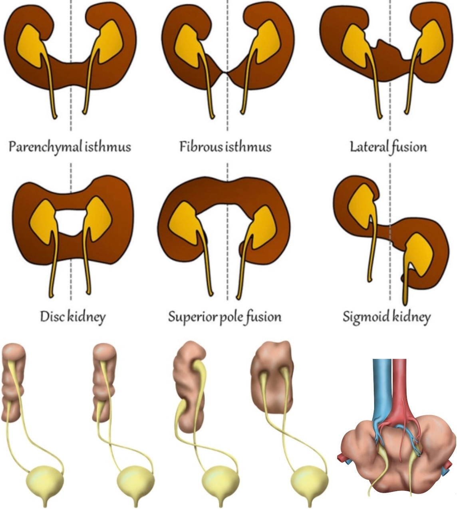
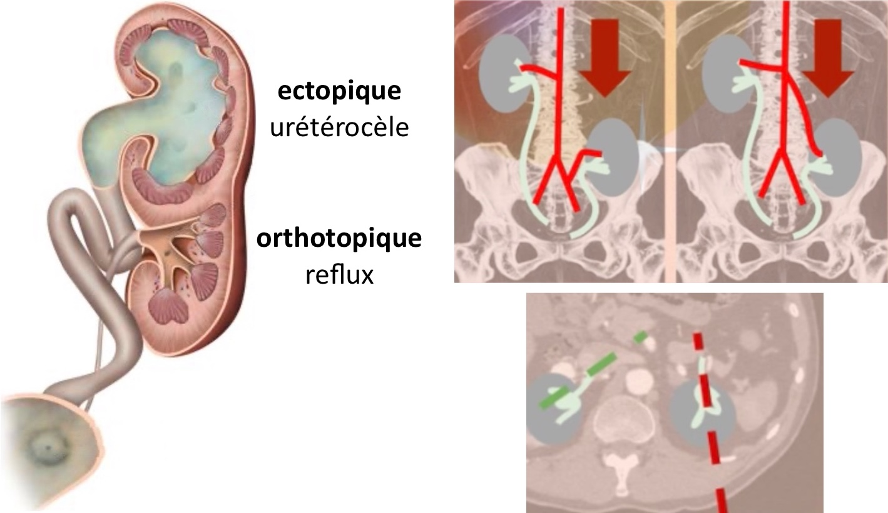
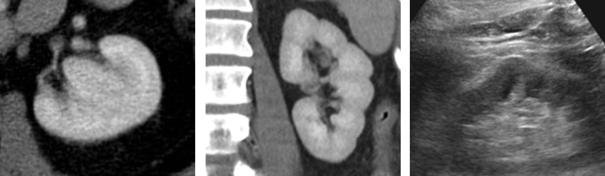
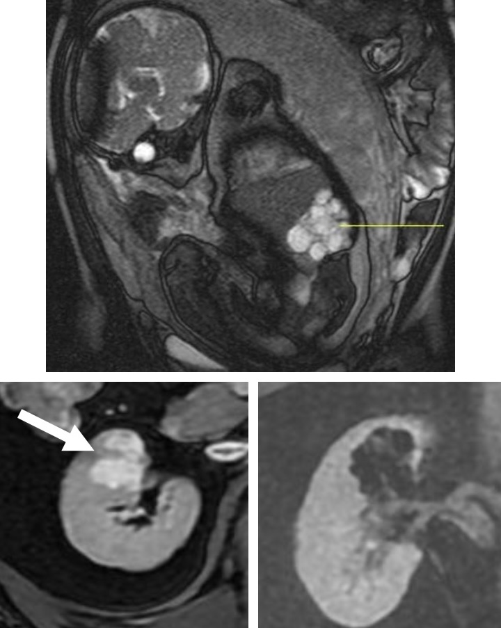

# Malformations rénales

<figure markdown="span">
    {width=500"}
    reins en <b>fer à cheval</b> / ectopie rénale croisée / reins pancake
      
    {width=580"}
    duplication urétérale complète / ectopie vs ptose / malrotation
      
    {width=580"}
    hypertrophie colonne de Bertin / lobulations fœtales / rein dromadaire
      
    {width=300"}
    dysplasie rénale multikystique (unilatérale et diffuse)
     ≠ <b>dystrophie kystique</b> (amas de kystes avec parenchyme sain entre)
</figure>