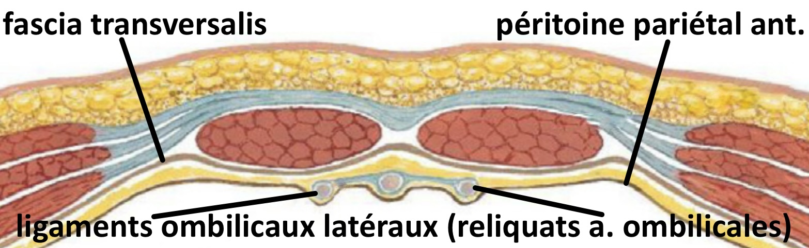
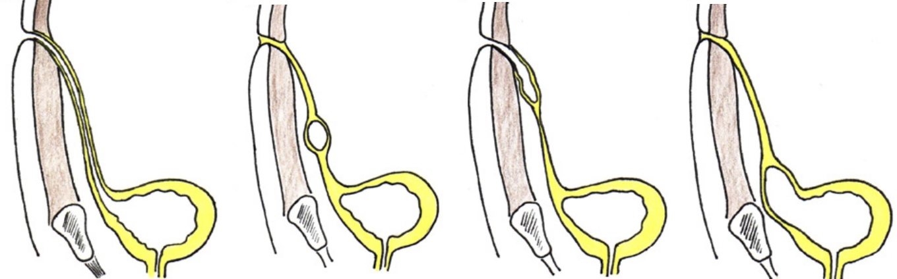
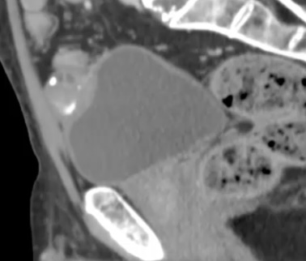
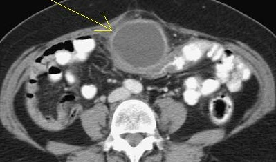

<figure markdown="span">
    {width=500"}
    dans le fascia ombilico-vésical
      
    {width=600"}
    fistule > kyste > sinus > diverticule
      
    {width=230"}
    /!\ <b>dégénérescence = Ca2+</b>, PDC, hADC
      
    {width=380"}
    infection
</figure>