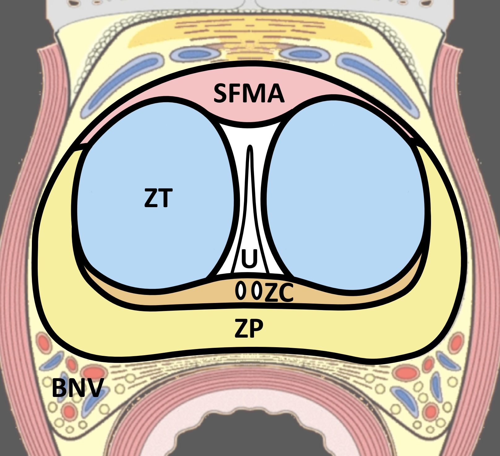
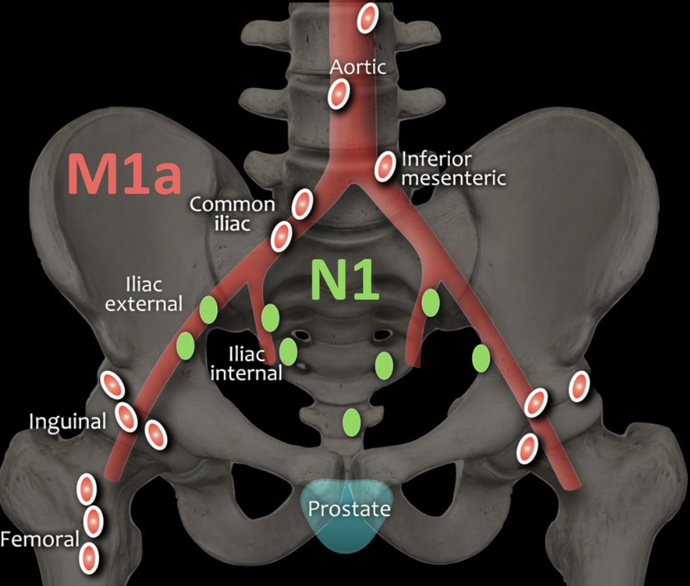
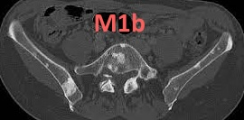
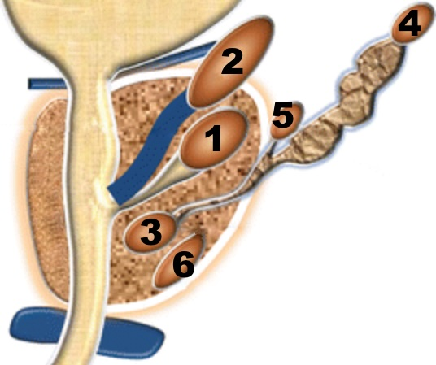

# [Prostate](https://www.pcih.fr/portal/pst_selectapp.php){:target="_blank"}

<figure markdown="span">
    {width=350"}  
    {width=350"}
    {width=350"}  
     
    {width=320"}
    1 : <b>kyste utricule</b> prostatique (rare surinfection/dégénérescence)
     2 : kyste mullérien (s'étend au-dessus de la base prostatique)
     3 : canal éjaculateur (paramédian, infertilité)
     4 : vésicule sém. (PKRAD), 5 : canal déférent, 6 : kyste rétentionnel (HBP)
</figure>
