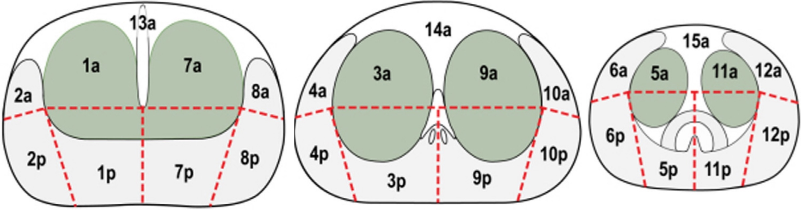

# [Prostate](https://www.pcih.fr/portal/pst_selectapp.php){:target="_blank"}

!!! info "[PI-RADS v2.1](https://radiologyassistant.nl/abdomen/prostate/prostate-cancer-pi-rads-v2-1){:target="_blank"}"
    * **ZP = DWI** (lésions postéro-latérales ++)
        * 1 = normal
        * 2 = linéaire ou angulaire
        * 3 = restriction focale modérée
            * +1 si DCE
        * 4 = marquée
        * 5 = marquée ≥ 15 mm ou EEP
    * **ZT = T2** (lésions antéro-inférieures ++)
        * 1 = nodule encapsulé
        * 2 = capsule incomplète / circonscrit / hypoT2 entre des nodules
            * +1 si restriction DWI marquée
        * 3 = hétérogène avec contours incertains / inclassable
            * +1 si restriction DWI marquée > 15 mm
        * 4 = signal intermédiaire homogène
        * 5 = ≥ 15 mm ou EEP

<figure markdown="span">
    {width=700"}
     
    {width=350"}
     
    {width=350"}
    {width=350"}
      
    {width=320"}
    1 : <b>kyste utricule</b> prostatique (rare surinfection/dégénérescence)
     2 : kyste mullérien (s'étend au-dessus de la base prostatique)
     3 : canal éjaculateur (paramédian, infertilité)
     4 : vésicule sém. (PKRAD), 5 : canal déférent, 6 : kyste rétentionnel (HBP)
</figure>
