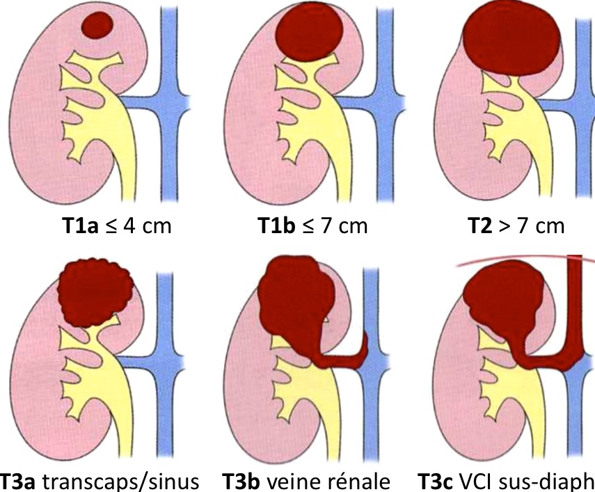

!!! info "[Bosniak](https://pubs.rsna.org/doi/full/10.1148/radiol.2019182646){:target="_blank"}" 
    === "TDM"
        * I = -9 à 20 UH (↬ 30 UH tps veineux), paroi ≤ 2 mm (± rehaussé), ∅ cloison ni Ca2+
        * II = ↬ 3 cloisons / Ca2+ / ≥ 70 UH / > 20 UH sans rehaussement en uroTDM
        * **IIF = ≥ 4 cloisons** / parois ou cloisons régulières de 3 mm
            * surveillance M6, M12, puis /an pdt 5 ans
        * III = parois ou cloisons régulières ≥ 4 mm / nodule ≤ 3 mm
        * IV = nodule ≥ 4 mm 
    === "IRM"
        * I = hyperT2 liquidien, paroi ≤ 2 mm (± rehaussé), ∅ cloison ni Ca2+
        * II = ↬ 3 cloisons / Ca2+ / hyperT1 marqué (2,5 x parenchyme sain)
        * **IIF = ≥ 4 cloisons** / parois ou cloisons régulières de 3 mm
            * surveillance M6, M12, puis /an pdt 5 ans
        * III = parois ou cloisons régulières ≥ 4 mm / nodule ≤ 3 mm
        * IV = nodule ≥ 4 mm 

!!! tip "Tumeurs solides (PDC > 25%)"
    * HYPERvascularisée  
        * **80% CCC** = nécrose, thrombose veine, Ca2+, Hdiff central, pseudocapsule hT2, HT2
            * métas poumons, os, gg, foie, surrénales, cerveau
        * **angiomyolipome** : graisse, cornet de glace, microanévrysmes
            * PAS de Ca2+, de kyste, ni de capsule hT2
        * **oncocytome** : HT2, cicatrice centrale hT2 avec PDC tardive, PDC radiaire centrifuge, yin-yang inversion PDC art/vein, HADC, ±capsule hT2
            * PAS de graisse (même micro, contrairement au CCC)
    * Hdiff et hypovasc/intermédiaire
        * carcinome **papillaire** : hypovasc, Hdense, HT1, hypoT2, ↗OP
        * tumeur **urothéliale** : infiltrant, hématurie, Ca2+ linéaires
        * **méta** : ronds, mal limités, kystiques
            * K épidermoïdes (poumons, ORL, œsophage)

!!! tip "Sd génétiques"
    * [VHL](https://radiopaedia.org/articles/von-hippel-lindau-disease-5){:target="_blank"} = CCC, kystes reins et pancréas, phéo, hémangioblastome cervelet
    * [STB](https://radiopaedia.org/articles/tuberous-sclerosis){:target="_blank"} = AML, LLM, tubers corticaux, nodules ss-épendymaires
    * [BHD](https://radiopaedia.org/articles/birt-hogg-dube-syndrome-5){:target="_blank"} = chromophobe, oncocytome, kystes bases pulm péribronchovasc irréguliers

<figure markdown="span">
    {width=450"}
</figure>