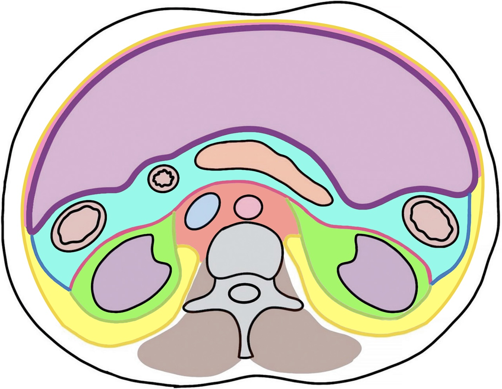
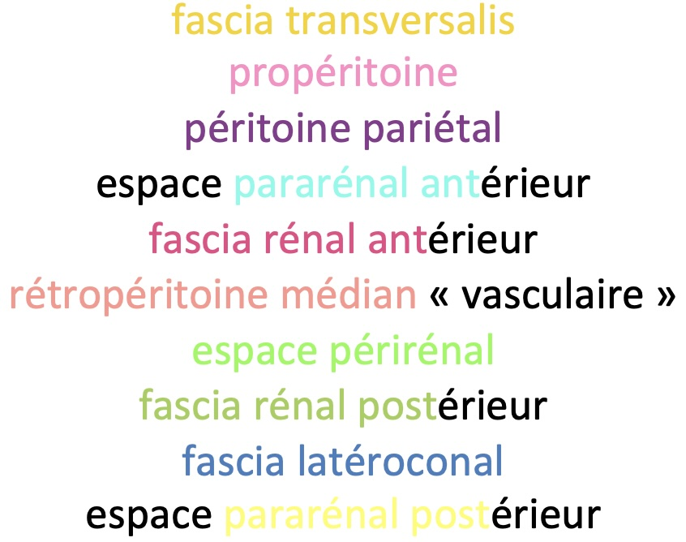
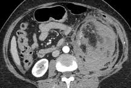

# Rétropéritoine

<figure markdown="span">
    {width=400"}
    {width=310"}
</figure>

!!! tip "Lésions"
    - primitive rare = 90% (lipo++)**sarcome**
    - **[fibrose](https://radiopaedia.org/articles/retroperitoneal-fibrosis-1){:target="_blank"} /!\ uretères** = active si PDC intense, HT2FS, Hdiff
    - Erdheim-Cheister = reins chevelus (DD lymphome, hématopoïèse extram.)
    - carcinose = sein, estomac, colon, prostate, poumon, rein

!!! tip "Hématome spontané = <b>AML</b> >> CCC"
    <figure markdown="span">
        {width=350"}
    </figure>