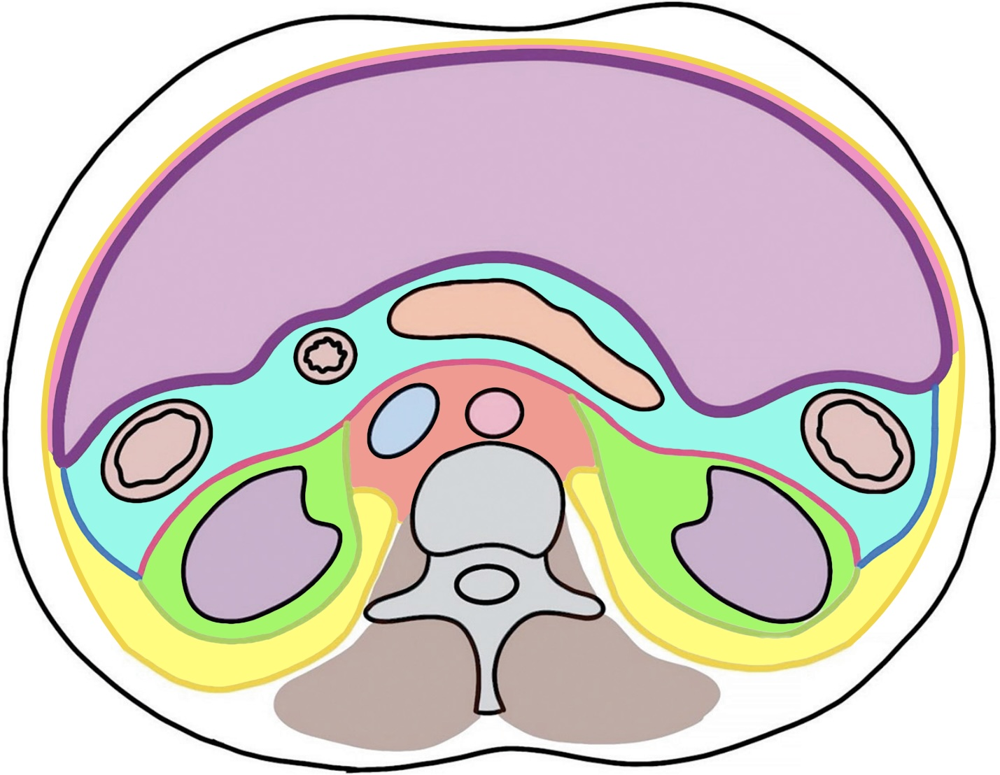
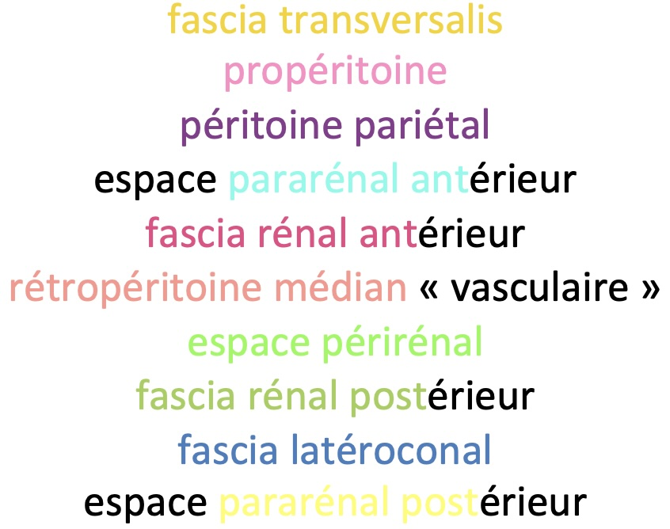

# Rétropéritoine

<figure markdown="span">
    {width=400"}
    {width=350"}
</figure>

!!! tip "Lésions"
    - primitive rare = 90% (lipo++)**sarcome**
    - **fibrose /!\ uretères** = active si PDC précoce, HT2FS, Hdiff
    - Erdheim-Cheister = reins chevelus (DD lymphome, hématopoïèse extram.)
    - carcinose = sein, estomac, colon, prostate, poumon, rein