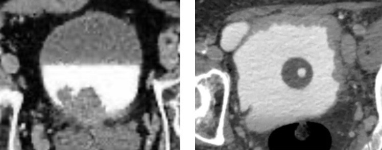
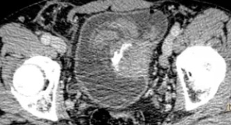
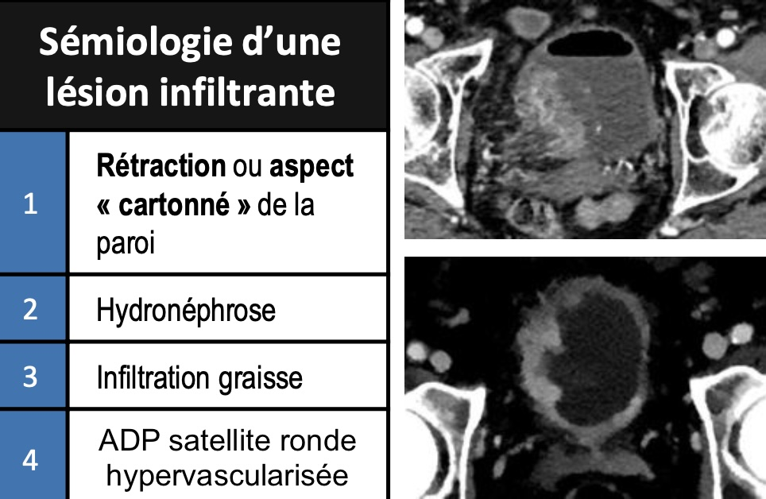
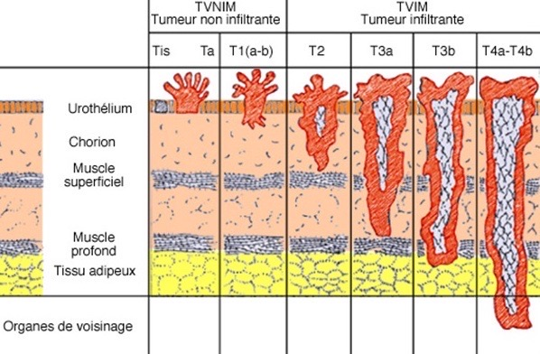
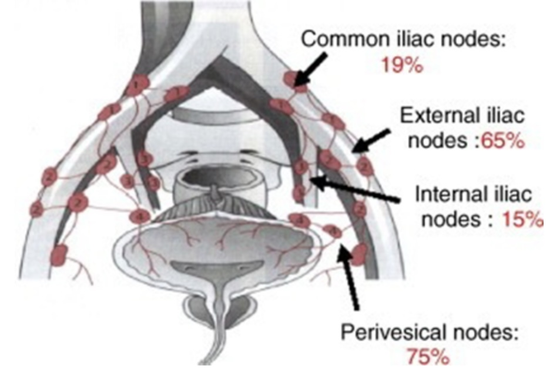
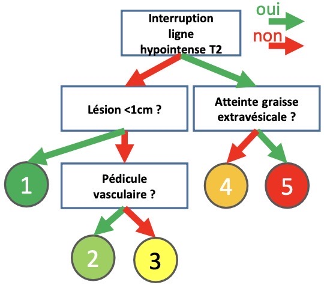
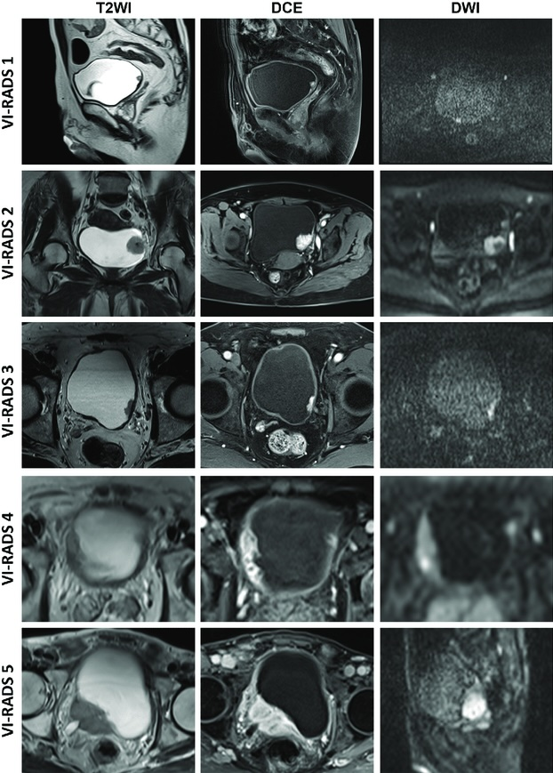
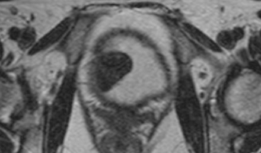

<figure markdown="span">
    H >50a <b>tabac hématurie</b> = 95% K urothélial (30% multifocal)
     > épidermoïde (bilharziose, sonde à demeure, cystite chronique)
    {width=350"}
    lésion <b>végétante</b> > infiltrante/mixte
    {width=250"}
    15% Ca2+ périphériques (DD bilharziose, BK)
      
    {width=400"}
    envahissement <b>péri-vésical = T3b</b>
    {width=550"}
    {width=400"}
     
    score <b>VI-RADS</b> > 15j après RTUV
    {width=450"}
    {width=600"}
     
    léiomyome = hT2, bénin, rare
    {width=300"}
</figure>